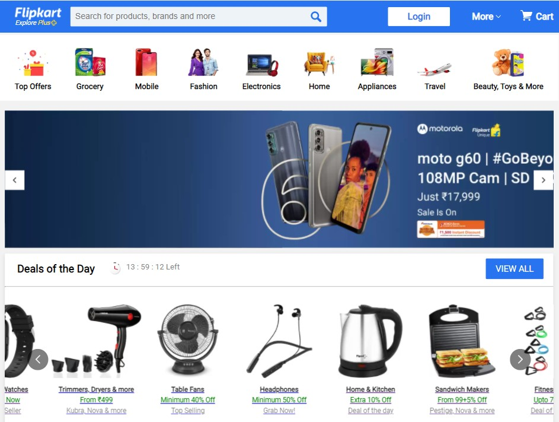

# Flipkart-Clone

Using React, Node.js, Express & MongoDB -- Full Stack MERN Application. The App is the clone of an E-Commerce website 'Flipkart'.

This application includes user authentication, full addition and deletion of item from cart functionlity and integrated paytm payment gateway. 

## Installation

run ``npm i && npm start`` for both client and server side to start the app
    